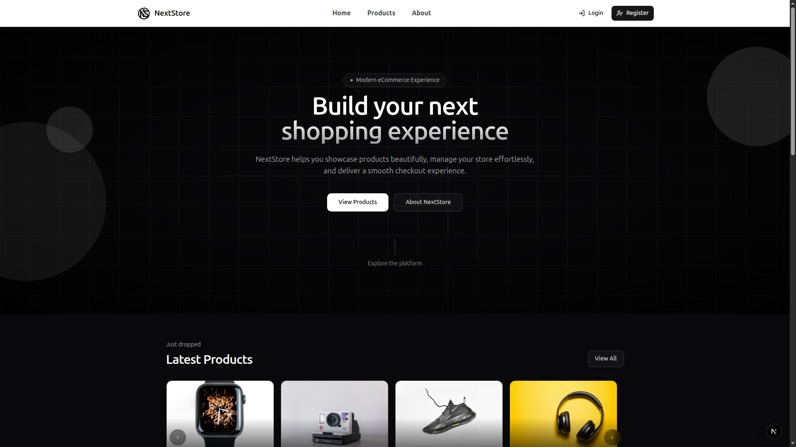

# NextStore Frontend

NextStore is a full ecommerce frontend built with Next.js App Router, TypeScript, TanStack React Query, React Hook Form, Zod, Tailwind CSS, and reusable UI primitives. It includes a public storefront, cookie-based authentication, a customer dashboard, cart and checkout flows, order history, and an admin panel for managing products, categories, users, and orders.



## Highlights

- Public storefront with home, products, product details, search, category filtering, pagination, and latest products
- Cookie-based authentication with login, registration, logout, protected dashboard routes, and admin-only route guards
- Customer dashboard with profile editing, address management, cart actions, checkout, and order history
- Admin dashboard with product, category, user, and order management
- Product create/edit form with shared form components, image upload UI, Zod validation, and accessible form labels
- Server-rendered public data fetching plus client-side mutations and cache invalidation with TanStack React Query
- Axios API client with credentials enabled and automatic refresh-token retry handling
- Unit tests with Vitest and route-protection E2E tests with Playwright

## Tech Stack

| Area | Tools |
| --- | --- |
| Framework | Next.js 16 App Router, React 19 |
| Language | TypeScript |
| Styling | Tailwind CSS 4, Shadcn-style UI primitives, Lucide React |
| Data | Fetch API for server components, Axios for client requests, TanStack React Query |
| Forms | React Hook Form, Zod |
| Charts | Recharts |
| Notifications | Sonner |
| Testing | Vitest, Playwright |
| Tooling | ESLint, npm |

## Project Structure

```txt
app/
  (site)/          Public storefront routes
  (auth)/          Login and registration routes
  (user)/          Customer dashboard routes
  (admin)/         Admin dashboard routes
components/
  HomePage/        Home page sections
  shared/          Shared app components
  ui/              Reusable UI primitives
features/
  auth/            Auth services, hooks, schemas, and components
  products/        Product services, hooks, schemas, forms, and UI
  categories/      Category services, hooks, schemas, and UI
  cart/            Cart services, hooks, and UI
  order/           Order services, hooks, and UI
  addresses/       Address services, hooks, schemas, and UI
  users/           User management services, hooks, schemas, and UI
lib/
  api/             API client, base URL, and error helpers
  schemas/         Shared schemas
e2e/               Playwright route-protection specs
```

## Core Features

### Storefront

- Responsive product grid and product cards
- Product detail pages
- Category sidebar
- Search and pagination
- Latest products carousel on the home page

### Authentication

- Login and registration pages
- Cookie-based auth through the backend
- Protected customer dashboard routes through `proxy.ts`
- Admin-only UI guard through profile role checks
- Refresh-token retry handling for authenticated API requests

### Customer Dashboard

- Profile management
- Address list, create, edit, and default address flows
- Cart quantity updates, item removal, and clear cart action
- Checkout with delivery address selection
- Order list and order details

### Admin Panel

- Admin overview dashboard
- Product CRUD with image upload
- Category CRUD
- User CRUD
- Orders table and order details
- Order status update flow

## Getting Started

### Prerequisites

- Node.js 20 or newer
- npm
- The companion NextStore backend running locally

Default API URL:

```txt
http://localhost:4000/api/v1
```

Swagger UI for the backend:

```txt
http://localhost:4000/api/docs
```

### Environment Variables

Create a local `.env` file from the example file:

```bash
cp .env.example .env
```

Required for the app:

```txt
NEXT_PUBLIC_API_URL=http://localhost:4000/api/v1
```

Required only for Playwright E2E tests:

```txt
E2E_CUSTOMER_EMAIL=
E2E_CUSTOMER_PASSWORD=
E2E_ADMIN_EMAIL=
E2E_ADMIN_PASSWORD=
```

The E2E credentials must match real users in your local backend database. The customer account should have a customer role, and the admin account should have an admin role.

### Install

```bash
npm install
```

### Run Locally

Start the backend first, then run the frontend:

```bash
npm run dev
```

Open:

```txt
http://localhost:3000
```

### Production Build

The build fetches server-rendered storefront data, so the backend should be running before building.

```bash
npm run build
npm run start
```

## Quality Checks

Run the full local frontend check:

```bash
npm run lint
npm test
npm run build
```

Current expected status:

- ESLint passes with no reported issues
- Vitest runs unit tests only
- Production build passes when the backend is available

## Testing

### Unit Tests

```bash
npm test
```

Unit tests are powered by Vitest. E2E files, Playwright reports, test results, and build output are excluded from Vitest discovery.

### E2E Tests

```bash
npm run test:e2e
```

Before running E2E tests:

- Start or seed the backend with one customer user and one admin user
- Add those credentials to `.env`
- Make sure `NEXT_PUBLIC_API_URL` points to the same backend

Playwright starts the Next.js dev server automatically through `playwright.config.ts`. The current Playwright project uses the local Chrome channel.

The E2E suite currently verifies:

- Guests are redirected from `/dashboard` and `/admin` to `/login`
- Redirect query params preserve the original protected path
- Customers can log in and are blocked from admin pages
- Admin users can access `/admin`
- Logout clears access to protected routes

## API Reference

This frontend is designed to work with the companion NextStore REST API.

See [API_REFERENCE.md](./API_REFERENCE.md) for request and response examples.

## Important Routes

| Route | Description |
| --- | --- |
| `/` | Home page |
| `/products` | Product listing, search, category filter, pagination |
| `/products/[id]` | Product detail page |
| `/login` | Login page |
| `/register` | Register page |
| `/dashboard` | Customer dashboard |
| `/dashboard/profile` | Customer profile |
| `/dashboard/addresses` | Customer addresses |
| `/dashboard/cart` | Shopping cart |
| `/dashboard/cart/checkout` | Checkout |
| `/dashboard/orders` | Customer orders |
| `/admin` | Admin dashboard |
| `/admin/products` | Admin product management |
| `/admin/categories` | Admin category management |
| `/admin/users` | Admin user management |
| `/admin/orders` | Admin order management |

## What This Project Demonstrates

- Building a real multi-section ecommerce frontend with Next.js App Router
- Organizing frontend code by business feature
- Combining server-rendered public pages with client-side dashboard interactions
- Managing async server state, mutations, and cache invalidation with React Query
- Validating forms with React Hook Form and Zod
- Building reusable form, table, pagination, dashboard, upload, and navigation components
- Handling authenticated API requests with cookies and refresh-token retry logic
- Protecting customer and admin routes in the UI and route layer
- Maintaining a clean project health workflow with lint, unit tests, E2E tests, and production builds

## Notes

- The frontend depends on the backend for product, auth, cart, address, user, and order data.
- Server-rendered pages that fetch products require the API to be reachable during production builds.
- Admin authorization should also be enforced by the backend API, not only by frontend route guards.
- Uploaded product images are expected to be served by the backend or an external image host.

## Author

Built as a full ecommerce frontend portfolio project.
